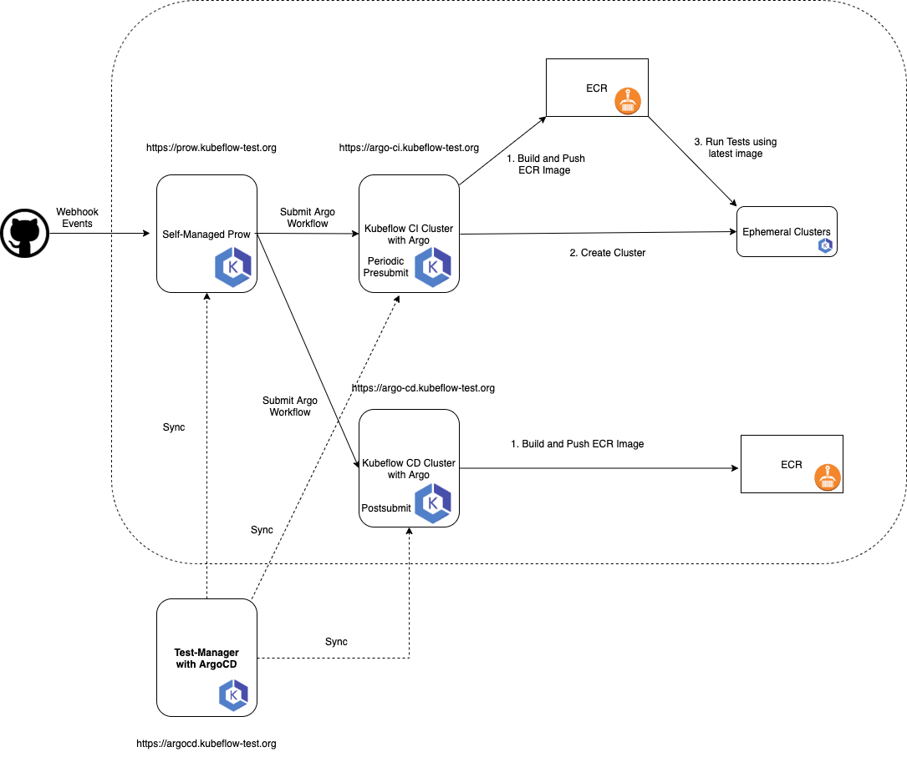

# Setting up Optional Test Infrastructure

This dic provides instructions for setting up optional test infrastructure.

Given our current design as below:



Our tests require:

* 3 K8s clusters
    * One cluster installed with Prow (**Control Plane**)
        * Prow cluster is responsible for communicating with GitHub and scheduling Argo workflow on Argo cluster
    * One cluster installed with Argo (**Data Plane**)
        * Argo cluster is responsible for managing Argo workflow's lifecycle
    * One cluster installed with ArgoCD (**Test Manager**)
        * ArgoCD cluster is responsible for synchronizing Prow and Argo cluster's configurations
* A shared NFS filesystem

### Create three EKS clusters

1. Prow Cluster

```shell script
EKS_CLUSTER_NAME="optional-test-infra-prow"
EKS_CLUSTER_VERSION="1.18"
AWS_REGION="us-west-2"

eksctl create cluster \
--name $EKS_CLUSTER_NAME \
--version $EKS_CLUSTER_VERSION \
--region $AWS_REGION \
--managed
```

2. Argo Cluster

```shell script
EKS_CLUSTER_NAME="optional-test-infra-argo"
EKS_CLUSTER_VERSION="1.18"
AWS_REGION="us-west-2"

eksctl create cluster \
--name $EKS_CLUSTER_NAME \
--version $EKS_CLUSTER_VERSION \
--region $AWS_REGION \
--managed
```

3. ArgoCD Cluster

```shell script
EKS_CLUSTER_NAME="optional-test-infra-argocd"
EKS_CLUSTER_VERSION="1.18"
AWS_REGION="us-west-2"

eksctl create cluster \
--name $EKS_CLUSTER_NAME \
--version $EKS_CLUSTER_VERSION \
--region $AWS_REGION \
--managed
```

### Prow Deployment
Generally we follow [prow community doc](https://github.com/kubernetes/test-infra/blob/master/prow/getting_started_deploy.md),
there are some customization we have done on AWS.

Prow manifests can be found [here](https://github.com/kubeflow/testing/blob/master/aws/User/clusters/optional-test-infra-prow/namespaces/prow/installs/installs.yaml)

Notice: we disabled Tide component because google-oss-bot will manage PR merge operation.

1. [Create Github bot account](https://github.com/kubernetes/test-infra/blob/master/prow/getting_started_deploy.md#github-bot-account) 
    * Create Github Token 
```shell script
kubectl create namespace prow
kubectl create secret -n prow generic github-token --from-file=token=${GITHUB_TOKEN}
```    
2. [Generate hmac-token](https://github.com/kubernetes/test-infra/blob/master/prow/getting_started_deploy.md#create-the-github-secrets)
```shell script
kubectl create secret -n prow generic hmac-token --from-file=token=${HMAC_TOKEN}
```
3. [Update sample manifests](https://github.com/kubernetes/test-infra/blob/master/prow/getting_started_deploy.md#update-the-sample-manifest)
    * Use our [customized manifest](https://github.com/kubeflow/testing/blob/master/aws/User/clusters/optional-test-infra-prow/namespaces/prow/installs/installs.yaml) instead 
    * Replace required parameters are always needed
        * The github token by replacing the `<<insert-token-here>>` string
        * The hmac token by replacing the `<< insert-hmac-token-here >>` string
        * The domain by replacing the `<< your-domain.com >>` string
        * Your github organization(s) by replacing the `<< your_github_org >>` string
4. Deploy Prow into Prow cluster
```shell script
kubectl apply -f ${PROW_INSTALLS}
```
5. Create aws-credential secret for authentication for Prow cluster's DataPlane (namespace: `test-pods`)
```shell script
kubectl create namespace test-pods
kubectl apply -f ${AWS_CREDENTIALS}
```
6. Configure ALB Ingress Controller and create ingress
```shell script
kubectl apply -f ${ALB_INGRESS_CONTROLLER}
```

### Argo Deployment
Generally we follow [argo community doc](https://argoproj.github.io/argo/quick-start/#install-argo-workflows),

Argo manifests can be found [here](https://github.com/kubeflow/testing/blob/master/aws/User/clusters/optional-test-infra-argo/namespaces/argo/installs/installs.yaml)

1. Deploy Argo into Argo cluster
```shell script
kubectl create namespace argo
kubectl apply -n argo -f ${ARGO_INSTALLS}
```

2. Configure ALB Ingress Controller and create ingress
```shell script
kubectl apply -f ${ALB_INGRESS_CONTROLLER}
```

3. Configure Argo Cluster's DataPlane (namespace: `kubeflow-test-infra`)
```shell script
kubectl create namespace kubeflow-test-infra
kubectl create clusterrolebinding kubeflow-test-infra-default-admin --clusterrole=cluster-admin --serviceaccount=kubeflow-test-infra:default
```

4. Configure NFS for Argo workflow data passing
    * [Configure EFS CSI Driver](https://docs.aws.amazon.com/eks/latest/userguide/efs-csi.html)
    * Customized manifests can be found [here](https://github.com/kubeflow/testing/blob/master/aws/User/clusters/optional-test-infra-argo/namespaces/kube-system/efs-csi-driver/)

5. Configure aws-credential secret for authentication

    * [TODO] PatrickXYS: Use IRSA (IAM Role for Service Account) to configure a specific service-account for delegation.
```shell script
kubectl apply -f ${AWS_CREDENTIALS}
```

6. Configure Kaniko for container image build and push

    * Generally we follow this [Kaniko community doc](https://github.com/GoogleContainerTools/kaniko#pushing-to-amazon-ecr)

```shell script
kubectl create secret generic aws-secret -n kubeflow-test-infra --from-file=${AWS_SECRET}
kubectl create configmap docker-config -n kubeflow-test-infra --from-file=${CONFIG_JSON}
```

7. Configure Argo with Github Token to avoid Throttling
```shell script
kubectl create secret generic github-token --namespace=kubeflow-test-infra --from-literal=github_token=${GITHUB_TOKEN}
```

8. (Optional) Configure Cluster AutoScaler for Horizontal Scaling EC2 AutoScalingGroup

    * Genrally we follow [AWS official documentation](https://docs.aws.amazon.com/eks/latest/userguide/cluster-autoscaler.html)


### Tekton Deployment
Generally we follow [tekton pipeline community doc](https://github.com/tektoncd/pipeline/blob/master/docs/install.md),
Tekton Pipeline customized manifests can be found [here](https://github.com/kubeflow/testing/blob/master/aws/User/clusters/optional-test-infra-tekton/namespaces/tekton-pipelines/installs/tekton_pipelines_installs.yaml)

1. Deploy Tekton Pipelines into Tekton Cluster
    * Note: Configure S3 bucket as Cloud Storage Bucket
```shell script
kubectl apply -f ${TEKTON_PIPELINE_INSTALLS}
```

2. Deploy Tekton Dashboard into Tekton Cluster
    * Configure ALB Ingress Controller for tekton dashboard endpoint
```shell script
kubectl apply -f ${ALB_INGRESS_CONTROLLER}
kubectl apply -f ${TEKTON_DASHBOARD_INSTALLS}
```

3. Configure Tekton Cluster's DataPlane (namespace: `kubeflow-test-infra`)
```shell script
kubectl create namespace kubeflow-test-infra
```

### ArgoCD Deployment
Generally we follow [argocd pipeline community doc](https://argoproj.github.io/argo-cd/getting_started/#1-install-argo-cd),
ArgoCD customized manifests can be found [here](https://github.com/kubeflow/testing/blob/master/aws/User/clusters/optional-test-infra-argocd/namespaces/argocd/installs/installs.yaml)

1. Deploy ArgoCD into ArgoCD Cluster
    * Note: Configure ALB Ingress Controller for ArgoCD endpoint
```shell script
kubectl apply -f ${ALB_INGRESS_CONTROLLER}
kubectl create namespace argocd
kubectl apply -n argocd -f ${ARGOCD_INSTALLS}
```

2. [Login and update password](https://argoproj.github.io/argo-cd/getting_started/#4-login-using-the-cli)
```shell script
kubectl get pods -n argocd -l app.kubernetes.io/name=argocd-server -o name | cut -d'/' -f 2
argocd login ${ALB_INGRESS_ENDPOINT}
```
3. [Register Prow, Argo, and Tekton Clusters](https://argoproj.github.io/argo-cd/getting_started/#5-register-a-cluster-to-deploy-apps-to-optional)
```shell script
argocd cluster add ${PROW_CLUSTER_CONTEXT}
argocd cluster add ${ARGO_CLUSTER_CONTEXT}
argocd cluster add ${TEKTON_CLUSTER_CONTEXT}
```
4. [Create applications for Synchronization](https://argoproj.github.io/argo-cd/getting_started/#6-create-an-application-from-a-git-repository)
```shell script
argocd app create prow-sync --repo https://github.com/kubeflow/testing.git --path aws/GitOps/clusters/optional-test-infra-prow/namespaces/prow --dest-server ${PROW_CLUSTER_SERVER} --dest-namespace prow --sync-policy automated --self-heal --project default
argocd app create argo-sync --repo https://github.com/kubeflow/testing.git --path aws/GitOps/clusters/optional-test-infra-argo/namespaces/argo --dest-server ${ARGO_CLUSTER_SERVER} --dest-namespace argo --sync-policy automated --self-heal --project default
argocd app create tekton-sync --repo https://github.com/kubeflow/testing.git --path aws/GitOps/clusters/optional-test-infra-tekton/namespaces/kubeflow-test-infra --dest-server ${TEKTON_CLUSTER_SERVER} --dest-namespace kubeflow-test-infra --sync-policy automated --self-heal --project default
```

